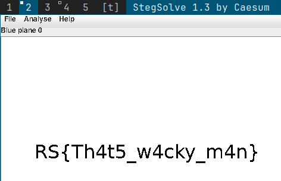

# Ritsec 2023

## BIN-PWN

### ret2win

> Are you looking for an exploit dev job. Well apply to the Republic of Potatoes. We are looking for the best hackers out there. Download the binary, find the secret door and remember to pass the right password.

> nc ret2win.challenges.ctf.ritsec.club 1337

Solution: [exploit.py](./ret2win/exploit.py)

```bash
$ python exploit.py
[+] Opening connection to ret2win.challenges.ctf.ritsec.club on port 1337: Done
[*] Switching to interactive mode
$ cat flag.txt
RS{WHAT'S_A_CTF_WITH0UT_RET2WIN}$
```

**Flag:** `RS{WHAT'S_A_CTF_WITH0UT_RET2WIN}`

## Either or Neither nor

> Made by MetaCTF

> Oh no! I was working on this challenge and totally forgot to save a backup of the decryption key! Do you think you could take a look and see if you can recover it for me?

> NOTE: The flag format is MetaCTF{}

> https://metaproblems.com/6ebee70f0d78d94a4750f9cb70031965/chal.py

A stream cipher is vulnerable to known-plaintext attacks. The key stream can be calculated.

Solution: [exploit.py](./either-or-neither-nor/exploit.py)

**Flag:** `MetaCTF{x0r_th3_c0re}`

## Web

### Echoes

> Do you hear that?

> https://echoes-web.challenges.ctf.ritsec.club/

The html page reflects the input. Enter e.g. `<a href="flag.txt">flag</a>`.


**Flag:** `RS{R3S0UND1NG_SUCS3SS!}`

### Rick Roll

> I mean, do I need to say more?

> https://rickroll-web.challenges.ctf.ritsec.club/

> NOTE: You will need to combine 5 parts of the flag together
> NOTE: Each part of the flag is used only once

The parts are hidden in the `.html` and `.css` files.  
Parts: `[RS{/\/eveRG0nna_], [D3s3RTy0u}], [|3tY0|_|d0vvn_], [G1v3y0uuP_], [TuRna30unD_]`

**Flag:** `RS{/\/eveRG0nna_G1v3y0uuP_|3tY0|_|d0vvn_TuRna30unD_D3s3RTy0u}`

## Steganography

### Weird

> This file was supposed to contain a secret message but it looks like just a blank page. Something weird is going on here.

The image was: [blank.png](./weird/blank.png)

The flag appeared by using `stegsolve` and `Blue plane 0` filter.



**Flag:** `RS{Th4t5_w4cky_m4n}`

### turtle

> Nothing to see here but a happy turtle.

The image was: [turtle.gif](./turtle/turtle.gif)

The flag is hidden in one of the frames. Extract all frames of the gif and skip through them
```bash
$ convert turtle.gif target.png
```


**Flag:** `RS{G00D_3Y3_&_H4PPY_TUR713}`


